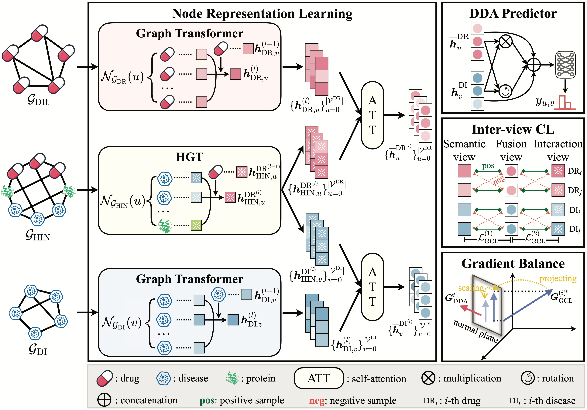

# paper_GCGB
This is the PyTorch implementation for paper "Heterogeneous Graph Contrastive Learning with Gradient Balance for Drug-Disease Association Prediction".

## Introduction
This paper presents a novel heterogeneous Graph Contrastive learning method with Gradient Balance for identifying potential DDAs (abbreviated as GCGB). GCGB consists of four crucial components, i.e., node representation learning, DDA predictor, inter-view contrastive learning (CL) and adaptive gradient balance. The primary innovations lie in the design of inter-view CL and adaptive gradient balance modules. Specifically, as for inter-view CL, a fusion view is introduced to integrate both higher-order relationships (drug-drug and disease-disease) and interaction information (drug-disease). Afterwards, we contrast the fusion view with semantic and interaction views respectively, thereby maximizing the mutual information between paired nodes across views. As for adaptive gradient balance, we dynamically adjust the gradient of GCL auxiliary tasks through reducing the proportion of conflicting gradient directions and measuring the proximity of gradient magnitudes at each training epoch, effectively achieving parameter update towards main task.

## Environment:
The codes of GCGB are implemented and tested under the following development environment:
-  Python 3.8.19
-  cudatoolkit 11.5
-  pytorch 1.10.0
-  dgl 0.9.1
-  networkx 3.1
-  numpy 1.24.3
-  scikit-learn 1.3.0

## Datasets
We verify the effectiveness of our proposed method on three commonly-used benchmarks, i.e., <i>B-dataset, C-dataset, </i>and <i>F-dataset</i>.
| Dataset |  Drug |  Disease |  Protein |  Drug-Disease | Drug-Protein |  Disease-Protein | Sparsity |
|:-------:|:--------:|:--------:|:--------:|:-------:| :-------:| :-------:| :-------:|
|B-dataset   | $269$ | $598$| $1021$ | $18416$ | $3110$ | $5898$ | $11.45\%$|
|C-dataset   | $663$ | $409$| $993$ | $2532$ | $3672$ | $10691$ | $0.93\%$|
|F-dataset   | $592$ | $313$| $2741$ | $1933$ | $3152$ | $47470$ | $1.04\%$|

These datasets can be downloaded from [google drive](https://drive.google.com/drive/folders/1w9orlSgM_HlwGwaVWPLYgRqbjdQc7RCv). Herein, we elaborate on the corresponding data files.
- <i>DrugFingerprint.csv</i>: The drug fingerprint similarity between each drug pairs.
- <i>DrugGIP.csv</i>: The drug Gaussian interaction profile (GIP) kernel similarity between each drug pairs.
- <i>DiseasePS.csv</i>: The disease phenotype similarity between each disease pairs.
- <i>DiseaseGIP.csv</i>: The disease GIP similarity between each disease pairs.
- <i> DrugDiseaseAssociationNumber.csv </i>: The known drug disease associations.
- <i> DrugProteinAssociationNumber.csv </i>: The known drug protein associations.
- <i> ProteinDiseaseAssociationNumber.csv </i>: The known disease protein associations.
- <i> Drug_mol2vec.csv </i>: The mol2vec embeddings of drugs.
- <i> DiseaseFeature.csv </i>: The feature embeddings of diseases.
- <i> Protein_ESM.csv </i>: The ESM-2 embeddings of proteins.

## Code Files:
The introduction of each <code> py </code> file is as follows:
- <i>contrastive_learning.py</i>: The implementation of inter-view contrastive learning.
- <i>data_preprocessing.py</i>: The implementation of data preprocessing.
- <i>GradientBalance.py</i>: The implementation of adaptive gradient balance.
- <i>graph_transformer_layer.py</i>: The implementation of graph transformer layer.
- <i>graph_transformer.py</i>: The implementation of basic graph transformer.
- <i>metric.py</i>: The implementation of evaluation metrics.
- <i>model.py</i>: The implementation of entire GCGB model.
- <i>main.py</i>: The implementation of model training.
- <i>parse_args.py</i>: The parameter settings.

## How to Run the Code:
Please firstly download the datasets and unzip the downloaded files. Next, create the <code>Datasets/</code> folder and move the unzipped datasets into this folder. The command to train GCGB on the B-dataset, C-dataset or F-dataset is as follows.

<ul>
<li>B-dataset<pre><code>python main.py --dataset = B-dataset</code></pre>
</li>
<li>C-dataset<pre><code>python main.py --dataset = C-dataset</code></pre>
</li>
<li>F-dataset<pre><code>python main.py --dataset = F-dataset</code></pre>
</li>
</ul>
</body></html>
